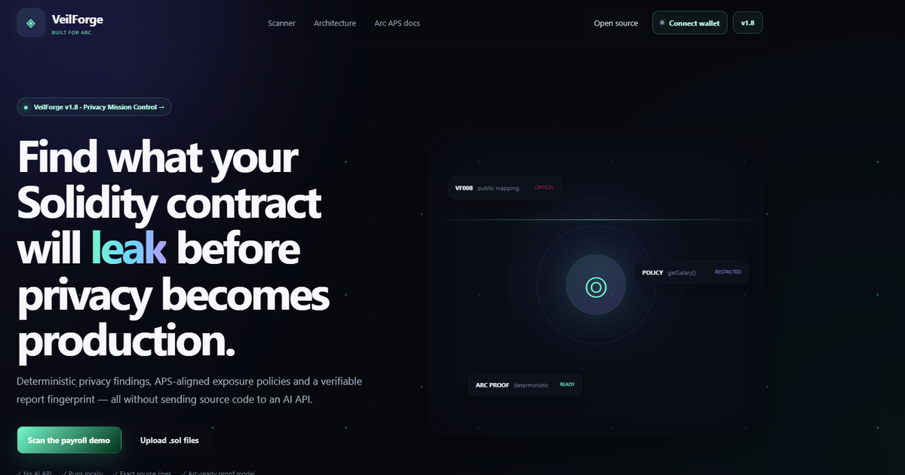
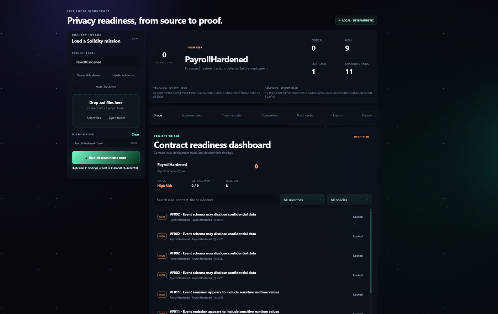

## Live Demo

[Launch VeilForge](https://veilforge-web.vercel.app)


## Arc Testnet Deployment

**Registry Contract:**  
[`0xf8b1D03931f2c11B642259d9aB19cfA3351C0Bbc`](https://testnet.arcscan.app/address/0xf8b1D03931f2c11B642259d9aB19cfA3351C0Bbc)


**First On-chain Report:**  
[View transaction on ArcScan](https://testnet.arcscan.app/tx/0x3270d43b814d4083aee3f97377495ff2866d58a43b792d41c5b04beb8d693d4d)


**Live App Transaction:**  
[View live app publication on ArcScan](https://testnet.arcscan.app/tx/0xa3585453549b60d71819df0e4c32d341687e7cf50836cce26e7add7830f5e1a1)


## Demo Video

[Watch the VeilForge demo](https://youtu.be/URAFCuYUQy0)


<p align="center">
  <strong>VeilForge v1.8 — Privacy Mission Control</strong><br>
  Deterministic, local-first privacy engineering for Solidity projects targeting Arc.
</p>

<p align="center">
  <code>No AI API</code> · <code>Local analysis</code> · <code>Deterministic output</code> · <code>Hashes only onchain</code>
</p>

<p align="center">
  <a href="https://veilforge-web.vercel.app"><strong>Live App</strong></a>
  ·
  <a href="https://testnet.arcscan.app/address/0xf8b1D03931f2c11B642259d9aB19cfA3351C0Bbc"><strong>Registry</strong></a>
  ·
  <a href="https://testnet.arcscan.app/tx/0x969534cc42f7c57e5c202f0abc65bcaef2f43a12ef24dcca454f334d9ef64d3a"><strong>Successful Arc Proof</strong></a>
  ·
  <a href="showcase/ARC_OPEN_SOURCE_SHOWCASE.md"><strong>Showcase</strong></a>
</p>

<p align="center">
  
</p>

> [!IMPORTANT]
> VeilForge is independent community-built pre-APS readiness tooling. It is not an official Circle product and is not a formal security audit. Arc privacy capabilities may evolve; always review current Arc documentation before deployment.

## What VeilForge does

VeilForge analyzes Solidity projects locally before deployment and turns deterministic privacy findings into an actionable engineering workflow:

- multi-file Solidity intake by files, folder, or drag-and-drop
- contract-by-contract readiness scores and deployment states
- deterministic findings with exact source evidence
- exposure chains: `Storage → Function → Event → Selector → Policy`
- Treatment Plan 2.0 with P0–P3 remediation priorities
- baseline comparison with resolved, ongoing, and introduced findings
- local browser scan history
- Proof Center 2.0 for Arc Testnet hash anchoring
- canonical JSON, Markdown, Arc Policy Manifest, and Remediation Pack ZIP exports
- reusable analyzer engine, CLI, custom-rule interface, JSON schemas, and integration examples

<p align="center">
  
</p>

## What changed from v1.1

v1.1 introduced remediation intelligence for single-contract scans. v1.8 expands VeilForge into a project-level Privacy Mission Control environment:

| v1.1 | v1.8 |
|---|---|
| primarily single-contract analysis | multi-file project intake and contract-level triage |
| findings and remediation guidance | readiness dashboard and deployment states |
| selector policy recommendations | deterministic exposure chains |
| before/after comparison | persistent baseline comparison with resolved, ongoing, and introduced findings |
| basic Arc proof flow | Proof Center 2.0 with simulation, receipt confirmation, and ArcScan verification |
| basic injected wallet connection | multi-EVM EIP-6963 wallet discovery and isolated sessions |
| JSON/Markdown/policy outputs | canonical JSON, Markdown, Arc Policy Manifest, and Remediation Pack ZIP |
| scanner interface | reusable engine, CLI, custom rules, schemas, examples, history, and exports |

## Trust model

VeilForge does **not** send Solidity source code to an AI model or remote analyzer.

1. Source files are normalized and analyzed locally.
2. The same sorted source bundle produces the same findings, source hash, and report hash.
3. Web, CLI, report exports, selector policies, and proof payloads use the same analyzer modules.
4. Optional Arc publication sends hashes and metadata—not source code or the complete report.
5. Local scan reports remain in browser `localStorage` and can be cleared from the interface. Matching source snapshots are retained only for the current browser session so historical exports never reuse unrelated files.

## Zero-dependency release architecture

v1.8 intentionally avoids a fragile frontend dependency graph. The release uses browser-native ES modules and Node.js built-ins.

```text
Solidity files
    │
    ▼
packages/analyzer/src
    ├── parser.js
    ├── rules.js
    ├── policies.js
    ├── exposure.js
    ├── report.js
    └── keccak.js
    │
    ├──────────────► Browser Mission Control
    ├──────────────► CLI / programmatic usage
    ├──────────────► JSON + Markdown + policy exports
    └──────────────► Arc proof payload
```

There are no npm runtime or development dependencies. `package-lock.json` is retained for reproducible install metadata.

## Run locally

Requirements:

- Node.js 20 or newer
- npm 10 or newer
- Chromium only for the optional browser smoke command

```bash
npm install
npm run build:web
npm run test
npm run typecheck
npm run smoke:browser
```

Serve the generated static app:

```bash
cd dist
python -m http.server 4173
```

Open `http://localhost:4173`.

## One-command preflight

```bash
npm run preflight
```

Preflight runs:

1. static web build
2. deterministic engine and proof tests
3. JavaScript syntax and JSON validation
4. Chromium CDP runtime smoke test
5. release-source SHA-256 manifest verification

## CLI

```bash
npm run scan:demo
node packages/analyzer/cli.mjs scan examples/multi-contract --format text
node packages/analyzer/cli.mjs scan examples/multi-contract --format json --output report.json
node packages/analyzer/cli.mjs scan examples/multi-contract --format markdown --output report.md
node packages/analyzer/cli.mjs scan examples/multi-contract --format policy --output arc-policy-manifest.json
```

## Programmatic usage

```js
import fs from 'node:fs';
import { scanProject, generatePolicyManifest } from './packages/analyzer/src/index.js';

const files = [{
  path: 'Payroll.sol',
  content: fs.readFileSync('Payroll.sol', 'utf8'),
}];

const report = scanProject(files);
const manifest = generatePolicyManifest(report);

console.log(report.status, report.score, report.reportHash);
console.log(manifest.policies);
```

See [`examples/programmatic-scan.mjs`](examples/programmatic-scan.mjs). Add `--write` to create Markdown and policy files beside the example.

## Custom detection rule

```js
const customRule = {
  id: 'TEAM001',
  title: 'Team-specific forbidden marker',
  severity: 'medium',
  detect({ parsedFiles }) {
    return parsedFiles.flatMap((parsed) =>
      parsed.source.content.includes('legacyPrivateFlow')
        ? [{
            file: parsed.source.path,
            contractName: parsed.contracts[0]?.name ?? 'Global',
            startLine: 1,
            evidence: 'legacyPrivateFlow',
            impact: 'A deprecated privacy flow remains enabled.',
            remediation: 'Remove the legacy flow before deployment.',
            suggestedPolicy: 'Locked',
          }]
        : [],
    );
  },
};

const report = scanProject(files, { customRules: [customRule] });
```

See [`examples/custom-rule.mjs`](examples/custom-rule.mjs) and [`docs/detection-rules.md`](docs/detection-rules.md).

## Built-in deterministic rules

| Rule | Default severity | Focus |
|---|---|---|
| `VF001` | Critical | sensitive automatic public getters |
| `VF002` | High | sensitive event schemas |
| `VF003` | Medium | secret-bearing revert text |
| `VF004` | High | unguarded sensitive reads |
| `VF005` | High | unguarded sensitive writes |
| `VF006` | Medium / Critical | low-level and delegate-style calls |
| `VF007` | Medium | sensitive cross-contract values |
| `VF008` | Critical / High | public mappings |
| `VF009` | Critical | unrestricted administrative mutation |
| `VF010` | Critical | `tx.origin` authorization |
| `VF011` | High | sensitive runtime event values |
| `VF012` | High | sensitive dynamic calldata |

Semantic-name checks are explicit heuristics with confidence metadata. VeilForge does not pretend that a heuristic is proof of a vulnerability.

## Readiness and treatment states

Severity penalties:

| Severity | Penalty | Treatment priority |
|---|---:|---|
| Critical | −25 | P0 |
| High | −15 | P1 |
| Medium | −8 | P2 |
| Low | −3 | P3 |

Triage states:

- **Deployment Blocked:** one or more critical findings
- **High Risk:** at least two high findings or score below 55
- **Review Required:** one or more non-critical findings
- **Ready:** no deterministic finding matched

A `Ready` result still requires manual review and normal security testing.

## Arc Proof Center 2.0

Default registry:

```text
0xf8b1D03931f2c11B642259d9aB19cfA3351C0Bbc
```

Arc Testnet:

```text
Chain ID: 5042002 (0x4CEF52)
RPC: https://rpc.testnet.arc.network
Explorer: https://testnet.arcscan.app
Gas token: USDC
```

The browser discovers installed EVM extension wallets through EIP-6963, falls back to legacy EIP-1193 injection, and encodes this exact ABI order:

```solidity
publishReport(
    bytes32 projectId,
    bytes32 sourceHash,
    bytes32 reportHash,
    uint16 score,
    string scannerVersion,
    string reportURI
)
```

VeilForge first simulates the proof call, then the selected wallet presents the transaction for user approval. The UI waits for the receipt and only reports success after the transaction is confirmed. Connecting does not automatically open the session panel; the connected address button opens it on demand. No private key is requested or stored by the app.

To override the registry during Vercel build:

```text
VITE_REGISTRY_ADDRESS=0x...
```

## Vercel

The repository contains a root [`vercel.json`](vercel.json):

- Build command: `npm run build:web`
- Output directory: `dist`
- Framework preset: none

Use the repository root as the Vercel Root Directory.

## Repository map

```text
apps/web/                  Browser Mission Control
packages/analyzer/src/     Canonical deterministic engine
packages/proof/src/        Arc chain config + ABI encoder + wallet flow
packages/analyzer/cli.mjs  CLI entrypoint
schemas/                   Report and policy JSON schemas
examples/                  Vulnerable, hardened, multi-file, custom-rule examples
contracts/                 Report Registry reference contract
scripts/                   Build, validation, manifest, preflight, browser smoke
showcase/                  Arc Open Source Showcase material
docs/                      Architecture and integration documentation
assets/v1.8/               README product screenshots
```

## Documentation

- [Architecture](docs/architecture.md)
- [Analyzer engine](docs/analyzer-engine.md)
- [Detection rules](docs/detection-rules.md)
- [Arc Policy Manifest](docs/policy-manifest.md)
- [Arc Proof Registry](docs/arc-proof-registry.md)
- [Integration examples](docs/integration-examples.md)
- [Showcase submission](showcase/ARC_OPEN_SOURCE_SHOWCASE.md)
- [Security policy](SECURITY.md)
- [Contributing](CONTRIBUTING.md)

## Previous releases

- **v1.1 — Remediation Intelligence:** detection-to-remediation workflow, APS-aligned selector guidance, and exportable findings.
- Older screenshots and demos are historical references; v1.8 is the current showcase release.

## License

MIT — see [`LICENSE`](LICENSE).
