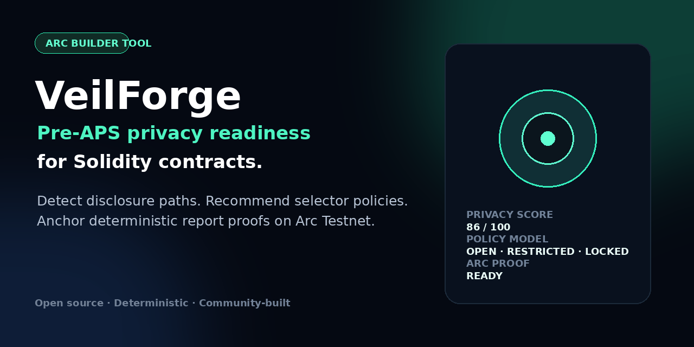
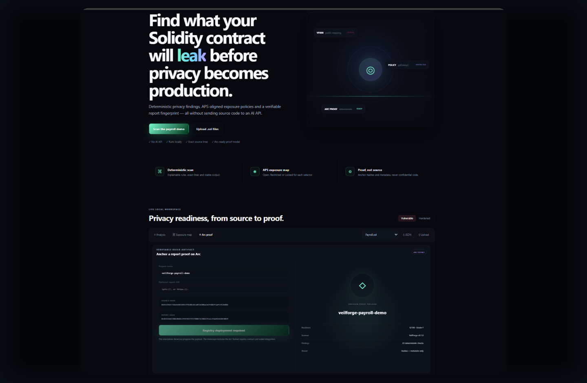
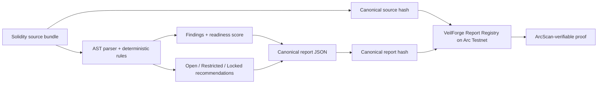

## Live Demo

[Launch VeilForge](https://veilforge-web.vercel.app)


## Arc Testnet Deployment

**Registry Contract:**  
[`0xf8b1D03931f2c11B642259d9aB19cfA3351C0Bbc`](https://testnet.arcscan.app/address/0xf8b1D03931f2c11B642259d9aB19cfA3351C0Bbc)


**First On-chain Report:**  
[View transaction on ArcScan](https://testnet.arcscan.app/tx/0x3270d43b814d4083aee3f97377495ff2866d58a43b792d41c5b04beb8d693d4d)


**Live App Transaction:**  
[View live app publication on ArcScan](https://testnet.arcscan.app/tx/0xa3585453549b60d71819df0e4c32d341687e7cf50836cce26e7add7830f5e1a1)


## Demo Video

[Watch the VeilForge demo](https://youtu.be/URAFCuYUQy0)


<p align="center">
  
</p>

<h1 align="center">VeilForge</h1>

<p align="center">
  <strong>Find what a Solidity contract may expose before privacy reaches production.</strong>
</p>

<p align="center">
  Deterministic privacy findings · APS-aligned selector recommendations · Arc Testnet report proofs
</p>

<p align="center">
  <a href="LICENSE"></a>
  
  
  
</p>

> [!IMPORTANT]
> **Arc Privacy Sector (APS) is not live yet.** VeilForge is independent, community-built **pre-APS readiness tooling** based on Arc's published privacy design. It does not execute private transactions, is not an official Circle product, and is not a formal security audit.

<p align="center">
  
</p>

## Why VeilForge exists

Existing Solidity contracts can disclose sensitive financial or identity data long before a developer reaches the privacy layer. Public getters, indexed events, plaintext calldata, unrestricted selectors, revert strings, and cross-contract flows can all undermine an otherwise private design.

VeilForge turns that migration problem into an explainable workflow:

```text
Solidity source
      ↓
Deterministic exposure rules
      ↓
Exact source-line findings + 0–100 readiness score
      ↓
Open / Restricted / Locked selector recommendations
      ↓
Canonical source + report fingerprints
      ↓
Optional proof anchored on Arc Testnet
```

## What reviewers can try in 60 seconds

1. Launch the zero-install showcase.
2. Scan the vulnerable payroll contract.
3. Open a finding at the exact disclosure line.
4. View the proposed APS exposure map.
5. Switch to the hardened contract and compare scores.
6. Export the deterministic JSON report.
7. Preview the Arc proof payload.

### Windows: zero-install showcase

```powershell
./run-demo.bat
```

Or serve it manually:

```powershell
cd standalone
python -m http.server 4173
```

Open `http://localhost:4173/scanner`.

## Core capabilities

| Capability | What it does |
|---|---|
| **Deterministic scanner** | Produces stable findings without an AI API or opaque model call |
| **Source-line evidence** | Reports the exact file and line range behind every finding |
| **Privacy readiness score** | Applies a transparent severity-based 0–100 scoring model |
| **Selector policy model** | Recommends `Open`, `Restricted`, or `Locked` with a human-readable reason |
| **Exposure map** | Visualizes sensitive selectors and their proposed policy boundaries |
| **Before / after lab** | Compares intentionally vulnerable and hardened payroll implementations |
| **Canonical fingerprints** | Normalizes source bundles and reports before hashing |
| **Arc proof registry** | Stores only report metadata and hashes — never private source code |
| **CLI + web interface** | Supports both developer automation and interactive review |

## Detection rules

VeilForge v0.1 ships with twelve explainable rules:

| Rule | Severity focus | Detects |
|---|---|---|
| `VF001` | High | Sensitive public state with automatic getters |
| `VF002` | High | Sensitive event schemas |
| `VF003` | Medium | Secret-bearing revert text |
| `VF004` | Critical | Unguarded sensitive read selectors |
| `VF005` | Critical | Unguarded sensitive state-changing selectors |
| `VF006` | High | Low-level and delegate-style calls |
| `VF007` | High | Sensitive values crossing contract boundaries |
| `VF008` | Critical | Public mappings and indexed-record exposure |
| `VF009` | Critical | Unrestricted administrative mutation |
| `VF010` | Critical | `tx.origin` authorization |
| `VF011` | High | Sensitive runtime values emitted in events |
| `VF012` | Medium | Sensitive plaintext in dynamic calldata |

Semantic-name rules are intentionally identified as heuristics and include confidence metadata. The objective is explainable migration guidance, not pretend certainty.

## Transparent scoring

| Severity | Penalty |
|---|---:|
| Critical | −25 |
| High | −15 |
| Medium | −8 |
| Low | −3 |

The result is clamped between 0 and 100. It is a prioritization signal, not a security guarantee.

## Architecture



The production scanner uses `@solidity-parser/parser`. The standalone showcase includes a dependency-free rule subset so a reviewer can test the product immediately.

## Full developer build

### Requirements

- Node.js 20+
- npm 10+

```bash
git clone https://github.com/CryptoDombili/veilforge.git
cd veilforge
npm install
npm run check
npm run dev
```

The terminal will print the local Vite URL.

## CLI

```bash
npm run build -w @veilforge/scanner
node packages/scanner/dist/cli.js scan examples/vulnerable-payroll/Payroll.sol
node packages/scanner/dist/cli.js scan contracts --json --output report.json
```

Example:

```text
VeilForge privacy readiness: 0/100 (F)
Findings: 8 critical, 7 high, 5 medium, 0 low

CRITICAL VF008 — Public mapping exposes indexed records
Payroll.sol:10
```

## Arc Testnet proof registry

`contracts/contracts/VeilForgeReportRegistry.sol` stores only:

- project ID
- source hash
- report hash
- readiness score
- optional report URI
- submitter
- timestamp
- scanner version

It never stores Solidity source or the full finding payload.

```text
Chain ID: 5042002
RPC: https://rpc.testnet.arc.network
Explorer: https://testnet.arcscan.app
Native gas asset: USDC
```

### Deploy with a disposable testnet wallet

```bash
cp .env.example contracts/.env
# Add ARC_PRIVATE_KEY manually. Never commit or paste it into chat.
npm run test -w @veilforge/contracts
npm run deploy:arc -w @veilforge/contracts
```

Then set:

```env
VITE_REGISTRY_ADDRESS=0x...
```

## Canonical hashing

Source bundles are normalized before hashing:

1. Convert CRLF to LF.
2. Normalize path separators.
3. Sort files by normalized path.
4. Concatenate path, a null separator, content, and a file separator.
5. Apply Keccak-256 in the production scanner.

Reports exclude timestamps and UI-only state, sort findings and policies deterministically, serialize keys canonically, and apply Keccak-256.

The dependency-free showcase uses browser-native SHA-256 only for its local preview. The TypeScript scanner and registry flow use the documented canonical process.

## Repository map

```text
apps/web/                 React + Vite product interface
packages/scanner/         AST scanner, policies, CLI, canonical hashing
packages/shared/          Shared types, Arc config, registry ABI
contracts/                Arc Testnet proof registry + tests
examples/                 Vulnerable and hardened payroll contracts
standalone/               Zero-install interactive showcase
docs/                     Architecture, threat model, roadmap, demo script
artifacts/                Example deterministic reports
.github/                  CI, issue templates, PR template, Dependabot
```

## Validation snapshot

The included fixtures currently produce:

| Fixture | Score | Findings |
|---|---:|---:|
| Vulnerable payroll | `0 / 100` | 23 |
| Hardened payroll | `100 / 100` | 0 |

See [`VALIDATION.md`](VALIDATION.md) for the exact local checks recorded with this release.

## Project principles

- **Deterministic before intelligent:** every finding must be reproducible and explainable.
- **No confidential source on-chain:** the registry anchors fingerprints and metadata only.
- **Honest product claims:** pre-APS readiness, not APS certification.
- **Arc-specific value:** privacy migration tooling rather than another generic payment demo.
- **Builder utility:** CLI, machine-readable output, CI-ready architecture, and reusable contracts.

## Documentation

- [Architecture](docs/architecture.md)
- [Threat model](docs/threat-model.md)
- [Roadmap](docs/roadmap.md)
- [90-second demo script](docs/demo-script.md)
- [Contributing](CONTRIBUTING.md)
- [Security policy](SECURITY.md)

## Responsible claims

Do **not** describe VeilForge as official, Circle-approved, APS-certified, a formal audit, or proof that a contract is secure/private.

Preferred description:

> Independent, community-built pre-APS migration tooling based on Arc's published privacy design.

## Technical references

- Arc opt-in privacy: `https://docs.arc.network/arc/concepts/opt-in-privacy`
- Connect to Arc: `https://docs.arc.network/arc/references/connect-to-arc`
- Deploy on Arc: `https://docs.arc.network/arc/tutorials/deploy-on-arc`

## Contributing

New deterministic rules, false-positive fixtures, report formats, and Arc builder integrations are welcome. Start with [`CONTRIBUTING.md`](CONTRIBUTING.md) or open a structured issue.

## License

MIT © CryptoDombili contributors
