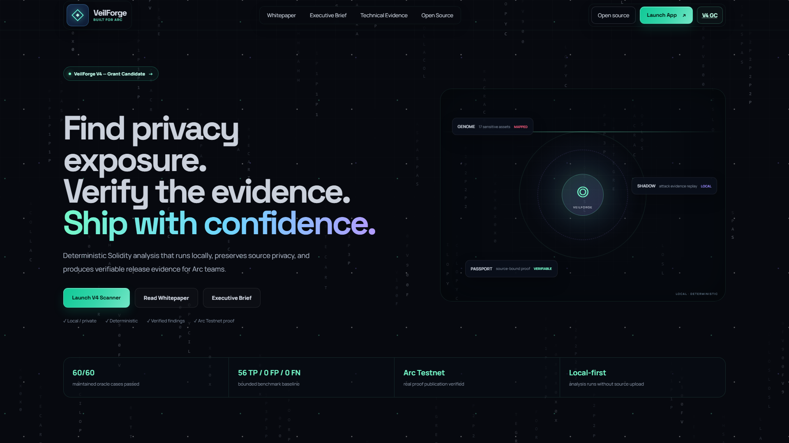
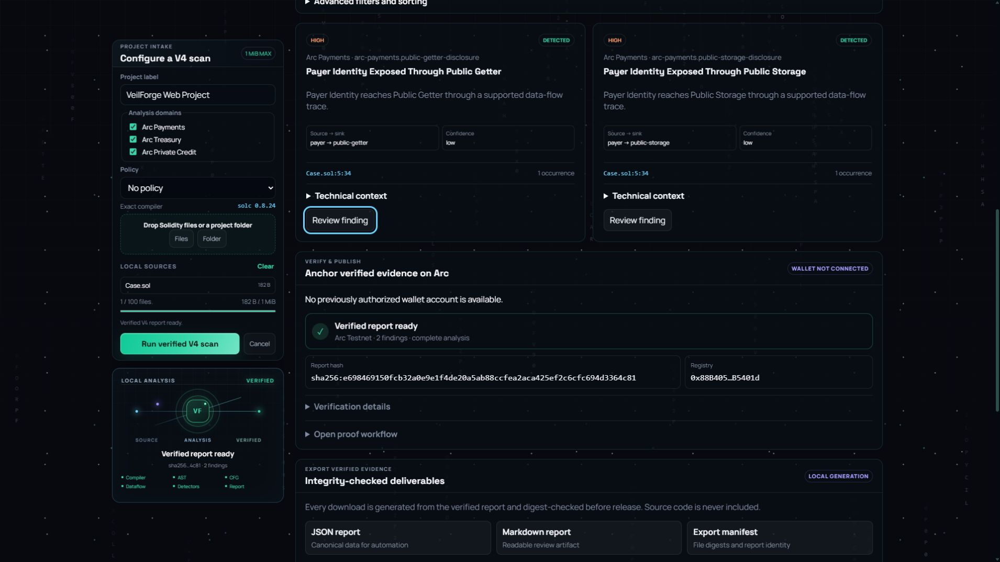
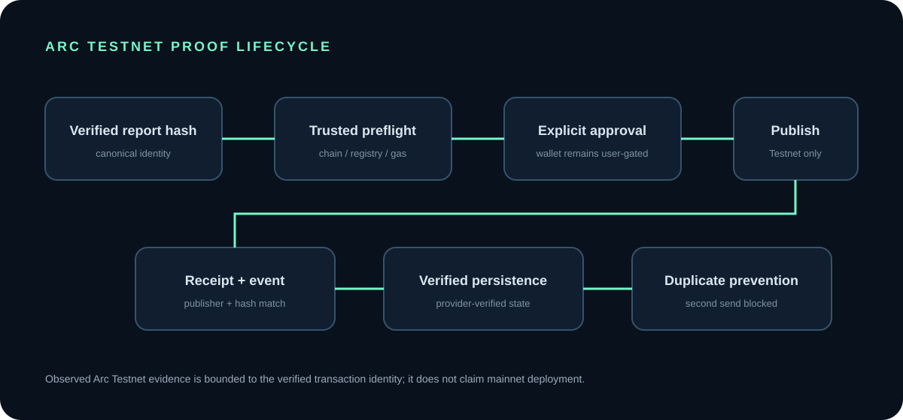

# VeilForge

<p align="center">
  <strong>Find privacy exposure. Verify the evidence. Prepare Solidity systems for Arc.</strong>
</p>

<p align="center">
  VeilForge is a local-first, deterministic privacy-readiness platform for Solidity projects building on Arc. It maps sensitive data flows, identifies disclosure surfaces, produces verifiable reports, and can optionally anchor report evidence on Arc Testnet.
</p>

<p align="center">
  
  
  
  
  
  
  
  
</p>

<p align="center">
  <a href="https://veilforge.dev"><strong>Live App</strong></a> ·
  <a href="https://veilforge.dev/app#scanner"><strong>Launch V4 Scanner</strong></a> ·
  <a href="https://veilforge.dev/whitepaper/">Whitepaper</a> ·
  <a href="https://veilforge.dev/whitepaper/executive-brief.html">Executive Brief</a> ·
  <a href="docs/grant/final/technical-evidence-index.md">Technical Evidence</a> ·
  <a href="https://github.com/CryptoDombili/veilforge/releases/tag/v4.0.0-gc.1">GitHub Release</a> ·
  <a href="https://testnet.arcscan.app/tx/0x75c62f12af38de075cbca5a3582faf587cec5f3809591efd0eebbef724d49ead">Arc Testnet Transaction</a> ·
  <a href="SECURITY.md">Security</a> ·
  <a href="CONTRIBUTING.md">Contributing</a>
</p>

VeilForge runs source analysis locally in the browser. Solidity source is not uploaded to an AI API or remote analyzer. Reports are deterministic, findings are bound to source locations and source-to-sink evidence, and the canonical report hash can be independently verified. The live V4 Grant Candidate is a working, tested release candidate—not a specification-only demo.

<p align="center">
  
</p>

## Why VeilForge

Solidity systems can disclose sensitive financial or identity data through events, public storage, return values, revert data, calldata, metadata, and external calls. VeilForge helps teams find and review those paths before release while keeping the analysis boundary explicit.

- **Local-first source analysis** — browser worker and CLI paths operate without remote source upload.
- **Deterministic findings** — stable finding identity, grouping, severity, confidence, completeness, and evidence.
- **Sensitive data-flow mapping** — source-to-sink traces across supported internal and external boundaries.
- **Arc-specific domain packs** — Arc Payments, Arc Treasury, and Arc Private Credit.
- **Policy-aware review** — declassification, accepted-risk, suppression, and incomplete states remain visible.
- **Canonical report identity** — schema `4.1.0` with hash payload `veilforge.report.hash.v2`.
- **Arc Testnet proof anchoring** — optional, explicit, zero-value publication through Registry V2.
- **Multi-file and folder intake** — bounded browser input with exact `solc 0.8.24`.
- **Verified exports** — canonical JSON, readable Markdown, and an export manifest with digests.
- **CLI and CI integration** — V4 CLI, SDK, SARIF, GitHub Actions, and policy gates.
- **Fail-closed incomplete analysis** — unsupported or unresolved boundaries are surfaced, not silently treated as safe.
- **Explicit safety boundaries** — no automatic wallet popup, network switch, transaction, or mainnet publication.

## Product workflow

| Step | What happens |
|---|---|
| **1. Configure** | Add Solidity files or a project folder, choose Arc domains, and select an optional policy. |
| **2. Scan** | Run deterministic compiler-backed analysis locally. Source code stays inside the browser or local CLI process. |
| **3. Review** | Inspect findings, severity, confidence, completeness, exact source locations, and source-to-sink traces. |
| **4. Verify** | Validate schema, evidence integrity, canonical report identity, and the report hash. |
| **5. Publish** | With a separate explicit wallet action, optionally publish a zero-value proof on Arc Testnet. Publisher-scoped duplicate protection prevents a second send for the same proof. |
| **6. Export** | Produce verified JSON, Markdown, and manifest deliverables. SARIF and GitHub Actions support are available for CLI/CI workflows. |

<p align="center">
  
</p>

## Verified Arc Testnet proof

The following real publication was verified read-only against Arc Testnet transaction, receipt, Registry V2 event, publisher-scoped duplicate state, and report identity.

| Field | Verified value |
|---|---|
| Transaction | [`0x75c62f12…d49ead`](https://testnet.arcscan.app/tx/0x75c62f12af38de075cbca5a3582faf587cec5f3809591efd0eebbef724d49ead) |
| Block | [`55602504`](https://testnet.arcscan.app/block/55602504) |
| Publisher | [`0x1769E693…27B167`](https://testnet.arcscan.app/address/0x1769E69333331eadE634e7cBB42a11f2e227B167) |
| Registry V2 | [`0x88B4055e…B5401d`](https://testnet.arcscan.app/address/0x88B4055eaB061CEa9BdfefF524f65ff461B5401d) |
| Transaction value | `0 USDC` |
| Report hash | `sha256:6715575c6f0f605b29f5527c48bb74fc452c7236e812d984a683a4a81aa78ba1` |

The proof anchors report evidence; it is **not** a confidentiality certificate. Solidity source code is never published on-chain. Registry V2 records are publisher-scoped and duplicate-protected, and publication always requires an explicit wallet action.

<p align="center">
  
</p>

## Demonstration fixture result

This is a **demonstration fixture result**, not a benchmark or a claim about general detection performance.

| Input | Observed result |
|---|---|
| `ArcPaymentsDemo.sol` | Arc Payments domain enabled |
| `ArcTreasuryDemo.sol` | Arc Treasury domain enabled |
| `ArcPrivateCreditDemo.sol` | Arc Private Credit domain enabled |
| Combined scan | 3 Solidity files; 41 canonical findings |
| Review state | 35 active detections; 6 incomplete findings |
| Integrity | Report hash verified |
| Proof | Arc Testnet proof published; existing transaction reverified |
| Completion | Publish and Export completed |

The maintained release benchmark is tracked separately in [`benchmarks/v4`](benchmarks/v4) and its methodology and evidence are documented in the [technical evidence index](docs/grant/final/technical-evidence-index.md).

## Built for Arc

VeilForge models privacy-readiness concerns for three concrete Arc application domains:

- **Arc Payments** — payer, payee, amount, payment references, public getters, event and calldata exposure.
- **Arc Treasury** — treasury operations, approvals, execution metadata, return and external-call disclosure.
- **Arc Private Credit** — borrower terms, collateral, credit metadata, and cross-contract boundaries.

The current proof workflow uses Arc Testnet Registry V2, ArcScan verification, and a zero-value publication call in Arc's USDC-native execution context. No other Circle product is represented as integrated. Arc mainnet network identity, proof reads, and publication remain fail-closed and disabled pending the documented readiness gates.

## Architecture

```text
Solidity files
  → canonical parser
  → deterministic detectors
  → data-flow graph
  → domain policy evaluation
  → canonical report
  → report hash
  → optional Arc Testnet proof
  → verified export
```

The browser runtime uses a bounded worker and exact `solc 0.8.24`. Node, browser, CLI, SDK, proof, and export layers share canonical report and integrity boundaries. See the [architecture documentation](docs/architecture.md) and [V4 whitepaper](docs/whitepaper/veilforge-v4-whitepaper.md) for the detailed model.

## Security boundaries

VeilForge is a privacy-readiness analysis and evidence tool. It is not:

- a formal security audit or replacement for independent review;
- a full EVM emulator;
- a symbolic prover;
- a confidentiality guarantee;
- a system that uploads source to an AI API or remote analyzer;
- a system that automatically opens a wallet popup, switches networks, or sends transactions;
- a mainnet proof publisher.

An **incomplete analysis** result is a positive fail-closed behavior: when VeilForge reaches an unsupported expression, unresolved boundary, budget limit, or other uncertainty, it preserves the evidence and marks the report incomplete instead of presenting absence of a finding as proof of safety.

Private keys and seed phrases remain inside the user's wallet and are never requested by VeilForge. Review the [security policy](SECURITY.md), [threat model](docs/grant-candidate/threat-model.md), and [product boundaries](docs/grant-candidate/product-boundary.md) before using results in a release decision.

## Quick start

1. Open the [V4 Scanner](https://veilforge.dev/app#scanner).
2. Upload Solidity files or a project folder.
3. Select one or more Arc domains and an optional policy.
4. Run the verified V4 scan.
5. Review findings, evidence, confidence, and incomplete states.
6. Optionally publish the verified report proof on Arc Testnet with an explicit wallet action.
7. Export the verified JSON, Markdown, and manifest deliverables.

## Local development

Requirements: Node.js 20 or newer. The repository pins `solc` exactly to `0.8.24`, so install from the lockfile before building.

```bash
npm ci
npm run build:web-v4-preview
npm run serve:web-v4-preview
```

Open `http://127.0.0.1:4174`. The preview command enables the V4 presentation locally; the source default remains fail-closed.

Focused validation commands:

```bash
npm run test:web-v4-runtime
npm run smoke:web-v4-real-scan
npm run test:web-v4-proof-preflight
npm run smoke:web-v4-ui
npm run manifest:check
```

Run the verified V4 CLI against the checked-in three-domain fixture:

```bash
node packages/cli/bin/veilforge.js scan \
  --project-id arc-three-domain-demo \
  --source examples/cli/three-domain-scan \
  --domain payments \
  --domain treasury \
  --domain private-credit \
  --no-export \
  --no-progress
```

Use `--output <directory>` instead of `--no-export` to write the verified export set. Run `node packages/cli/bin/veilforge.js --help` for report verification, export verification, SARIF, and gate options.

## Repository structure

| Path | Purpose |
|---|---|
| [`apps/web`](apps/web) | Static V3/V4 web application, browser worker adapter, scanner UI, proof UI, and verified exports. |
| [`packages/analyzer`](packages/analyzer) | Legacy-compatible analyzer entry points and shared source-analysis code. |
| [`packages/proof`](packages/proof) | Canonical V4 proof envelopes, network model, verification, persistence, and compatibility. |
| [`contracts`](contracts) | Reference publisher-scoped report registry contract and ABI material. |
| [`examples`](examples) | CLI, SDK, vulnerable, remediated, and multi-contract fixtures. |
| [`schemas`](schemas) | Report and policy schemas, including V4 report schema `4.1.0`. |
| [`benchmarks/v4`](benchmarks/v4) | Maintained V4 corpus, oracle, gate configuration, and benchmark identity. |
| [`docs`](docs) | Architecture, release, proof, grant, business, whitepaper, and operational documentation. |
| [`tests`](tests) | Deterministic unit, integration, browser, proof, security, benchmark, and regression tests. |
| [`scripts`](scripts) | Build, smoke, benchmark, release-manifest, proof-reconciliation, and readiness tools. |

## Documentation

| Document | Description |
|---|---|
| [V4 Whitepaper](docs/whitepaper/veilforge-v4-whitepaper.md) | Architecture, analysis model, evidence, proof, limitations, and roadmap. |
| [Executive Brief](docs/whitepaper/veilforge-v4-whitepaper-executive-brief.md) | Concise product, Arc relevance, evidence, and grant overview. |
| [Technical Evidence](docs/grant/final/technical-evidence-index.md) | Reproduction paths for scanner, benchmark, proof, web, and release claims. |
| [Grant Evidence](docs/grant/final/executive-summary.md) | Final grant evidence package entry point. |
| [Security](SECURITY.md) | Supported security reporting and operational boundaries. |
| [Contributing](CONTRIBUTING.md) | Repository contribution workflow. |
| [Release Notes](docs/releases/v4.0.0-rc1.md) | V4 RC1 release integration notes and gates. |
| [Product Boundaries](docs/grant-candidate/product-boundary.md) | Claims the product makes—and deliberately does not make. |
| [Mainnet Readiness](docs/releases/v4-arc-mainnet-readiness.md) | Disabled-by-default mainnet controls, rehearsal, and blockers. |

## Roadmap

**Current**

- V4 Grant Candidate and live production presentation
- local browser scanner and deterministic CLI/SDK
- Arc Testnet proof workflow with receipt/event reconciliation
- verified JSON, Markdown, manifest, and SARIF exports
- CI gates and GitHub Actions integration

**Next**

- broader developer validation and feedback
- stronger compiler-backed analysis coverage
- expanded Arc domain rules and fixtures
- production documentation and onboarding
- controlled mainnet-readiness work with independent review

Mainnet is not active. `enabled=false`, `proofReadEnabled=false`, and `publishEnabled=false` remain the canonical mainnet state.

## Why this grant matters

Grant support would help VeilForge advance measurable engineering work in:

- analyzer accuracy and precision;
- compiler-backed coverage;
- developer onboarding and reproducible examples;
- Arc-specific rules and fixtures;
- CI integrations;
- documentation and production hardening;
- external security review.

No grant amount, customer, partnership, revenue, or future integration is assumed here. Commercial plans remain documented roadmap hypotheses.

## Previous release

VeilForge V3.2.2 remains available as a legacy-compatible local privacy engineering workbench. The repository's primary product and grant narrative is now the implemented V4 Grant Candidate.

## License

VeilForge is open source under the [MIT License](LICENSE).
