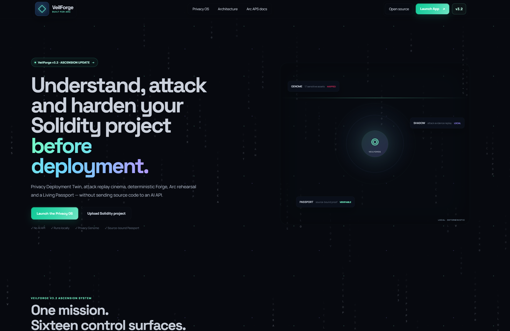

## Live


[Launch VeilForge](https://veilforge.dev/)


## Arc Testnet Deployment

**Publisher-Scoped Registry V2:**  
[`0x88B4055eaB061CEa9BdfefF524f65ff461B5401d`](https://testnet.arcscan.app/address/0x88B4055eaB061CEa9BdfefF524f65ff461B5401d)

Registry V2 scopes every latest report by `projectId + publisher`, preventing one wallet from overwriting another wallet's record.


**VeilForge v3.2.2 Registry V2 On-chain Proof:**  
[View successful v3.2.2 Registry V2 proof transaction on ArcScan](https://testnet.arcscan.app/tx/0x1570613b97c1dc190529b4b0b79a600afb30cfb76148b2c778771c074d3ebe47)


**Live App Transaction:**  
[View live app publication on ArcScan](https://testnet.arcscan.app/tx/0xa3585453549b60d71819df0e4c32d341687e7cf50836cce26e7add7830f5e1a1)


## Demo Video

[Watch the VeilForge demo](https://youtu.be/7RiI7QfxWzo)


## VeilForge v3.2 — Privacy Operating System

VeilForge is an open-source, local-first privacy engineering workbench for Solidity projects on Arc.


<p align="center">
  
</p>

<p align="center">
  <strong>Local, deterministic privacy engineering for Solidity projects targeting Arc.</strong>
</p>

VeilForge v3.2 expands the original deterministic scanner into a source-bound privacy operating system:

### Ascension update

- **Privacy Deployment Twin** compares public Arc behavior with an explicitly labeled APS roadmap readiness model.
- **Attack Replay Cinema** animates deterministic source-evidence paths without claiming bytecode execution.
- **Deployment Lineage + Living Passport** bind source, intent, evidence, forge review, bytecode, and deployment evidence into one revisioned identity.
- **Arc Deploy Rehearsal** blocks unsafe wallet flows and documents Arc Testnet, USDC gas, source, intent, and APS availability checks.
- **Privacy CI Gate** adds a real `--gate` CLI exit code and an exportable GitHub Actions workflow.
- **Domain Rule Packs** activate project-specific payroll, RWA, stablecoin, treasury, healthcare, and agent-payment controls.
- **Source-guided Fuzz Plan** exports deterministic selector properties and vectors for compiler-backed Foundry execution.

APS is not currently available on Arc. VeilForge treats APS behavior as a readiness simulation and never labels it as live confidential execution.

- **Privacy Genome** maps sensitive assets, actors, source relationships and disclosure boundaries.
- **Privacy Intent Compiler** generates a portable policy document and checks code-to-intent alignment.
- **No-Code Privacy Intent Studio** lets builders declare disclosure defaults and required controls without editing YAML.
- **Shadow Evidence Lab** reproduces deterministic attack paths from exact source evidence.
- **Transaction MRI** explains how each disclosure moves from call surface to policy boundary.
- **Forge Mode** prepares narrow candidate hardening edits and refuses unsafe generic mutations.
- **Privacy Passport** binds the project’s privacy state to its canonical source hash.
- **Arc Proof Center** can anchor the canonical report fingerprint on Arc Testnet.

Source code is processed locally. VeilForge does not send Solidity source to an AI API or remote analyzer.

## Current release

**Version:** `3.2.2`

This is a production release of the deterministic source-analysis platform, not a claim of full compiler-grade or arbitrary EVM analysis. The current Shadow Lab performs deterministic source-evidence replay. Forge Mode produces candidate edits that still require compilation, tests and engineering review before deployment.

## Core flow

```text
Solidity source
      ↓
Canonical parser + deterministic rules
      ↓
Privacy Genome + Disclosure Matrix
      ↓
Privacy Intent Compliance
      ↓
Shadow Evidence Campaigns
      ↓
Transaction MRI
      ↓
Forge Candidate Plan
      ↓
Source-bound Privacy Passport
      ↓
Optional Arc Testnet proof
```

## What remains compatible from v1.8

- Multi-file and folder intake
- Deterministic findings with exact source lines
- Contract-level readiness and deployment status
- Exposure chains
- P0–P3 Treatment Plan
- Scan comparison and local history
- Arc Policy Manifest
- JSON and Markdown reports
- Hash-only Arc Testnet proof publication
- EIP-6963 wallet discovery
- CLI and custom rules

## Local web app

The project has no runtime package dependencies.

```bash
npm run build:web
python -m http.server 8080 -d dist
```

Then open `http://localhost:8080`.

## Validation

```bash
npm test
npm run typecheck
npm run smoke:browser
npm run manifest:check
```

Or run the full release gate:

```bash
npm run preflight
```

The preflight gate rebuilds the static application, runs the Node test suite, validates JavaScript and JSON, opens the product in real headless Chromium, checks the desktop and 390 px mobile layouts, exercises the main workspaces and verifies the release manifest.

## CLI

```bash
node packages/analyzer/cli.mjs scan examples/vulnerable-payroll --format text
node packages/analyzer/cli.mjs scan examples/vulnerable-payroll --format json
node packages/analyzer/cli.mjs scan examples/vulnerable-payroll --format markdown
node packages/analyzer/cli.mjs scan examples/vulnerable-payroll --format policy
```

## Privacy Genome output

The canonical report now includes:

```json
{
  "privacyGenome": {
    "assets": [],
    "actors": [],
    "disclosureMatrix": [],
    "graph": { "nodes": [], "edges": [] },
    "metrics": {
      "sensitiveAssets": 0,
      "publicExposures": 0,
      "blastRadius": 0
    }
  }
}
```

## Privacy Intent

VeilForge includes a visual policy studio and creates a deterministic YAML policy such as:

```yaml
version: "3.2"
mode: local-deterministic
defaults:
  public_observer: denied
  external_contract: restricted
  record_owner: allowed
controls:
  require_least_privilege: true
  require_revocation_path: true
  prohibit_sensitive_revert_data: true
  require_deployment_lineage: true
```

Changing a declared policy creates a new canonical report hash while preserving the source hash. Compliance is therefore bound to both the exact Solidity source and the selected privacy intent.

## Shadow Evidence Lab

Every deterministic finding can become a source-evidence campaign containing:

- adversary profile
- disclosure channel
- exact contract, file and line
- reachability steps
- impact narrative
- confidence
- estimated privacy blast radius

The current release does **not** claim full EVM emulation. That boundary is explicit in the UI and report.

## Forge Mode

Forge Mode automatically prepares candidate edits only when the transformation is narrow and inspectable. Examples include:

- public sensitive state → private state candidate
- `tx.origin` authorization findings → mandatory engineering review
- sensitive revert text redaction candidate

Potentially unsafe generic changes remain marked **Engineering review**. Candidate ZIPs contain a warning, the full Forge plan and the proposed source files. They are not labeled deploy-ready.

## Privacy Passport

The Passport includes:

- canonical project and source IDs
- technical safety score
- intent compliance
- attack defense score
- identity-protection estimate
- source-bound evidence counts
- deployment gate state
- explicit limitations

A Passport is only bound to the source hash. It does not claim that an arbitrary deployment matches the source until deployment lineage is added in a future release.

## Arc proof model

VeilForge publishes no Solidity source onchain. The proof payload contains canonical hashes and report metadata. Wallet approval remains explicit.

The reference registry is located at:

```text
contracts/VeilForgeReportRegistry.sol
```

## Project structure

```text
apps/web/                     static Privacy OS interface
packages/analyzer/src/        canonical deterministic analyzer
packages/proof/src/           Arc Testnet proof and wallet integration
contracts/                    reference proof registry
examples/                     vulnerable, hardened and multi-contract fixtures
schemas/                      report and policy JSON schemas
scripts/                      build, validation and browser smoke tools
tests/                        deterministic analyzer, proof, Forge and schema tests
docs/                         architecture and product documentation
```

## Security boundaries

VeilForge is an engineering aid, not a formal audit, compiler, symbolic prover or full EVM emulator.

- Never deploy Forge candidates without compiling and testing them.
- Review access-control and ABI changes manually.
- Verify registry addresses before publishing proofs.
- Keep private keys inside the wallet; VeilForge never requests them.
- Use professional security review for production financial systems.

## License

MIT
