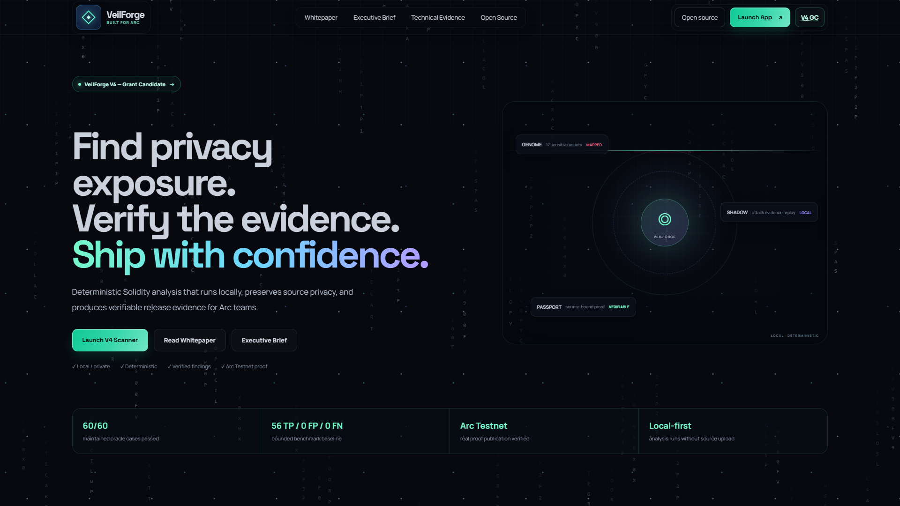
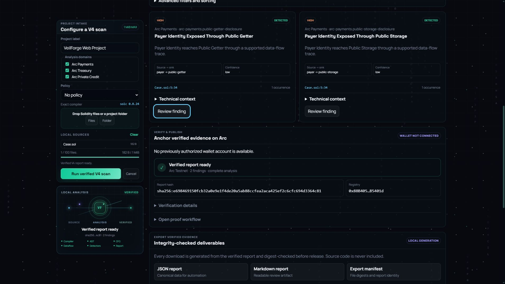
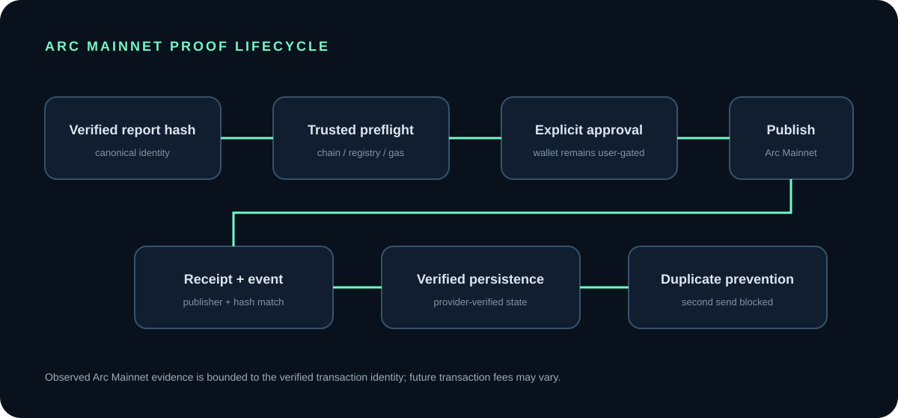

# VeilForge

<p align="center">
  <strong>Local Solidity privacy analysis for Arc applications.</strong>
</p>

<p align="center">
  VeilForge helps Solidity developers and security reviewers trace how financial data can reach events, public storage, return values, revert data, calldata, metadata, and external calls. It analyzes multi-file projects locally with exact solc 0.8.24 and supports optional report-hash publication through a trusted Arc runtime profile. The official production artifact uses verified Arc Mainnet.
</p>

<p align="center">
  
  
  
  
  
  
  
  
</p>

<p align="center">
  <a href="https://veilforge.dev"><strong>Live App</strong></a> ·
  <a href="https://veilforge.dev/app#scanner"><strong>Launch V4 Scanner</strong></a> ·
  <a href="https://veilforge.dev/whitepaper/">Whitepaper</a> ·
  <a href="https://veilforge.dev/whitepaper/executive-brief.html">Executive Brief</a> ·
  <a href="docs/grant/final/technical-evidence-index.md">Technical Evidence</a> ·
  <a href="https://github.com/CryptoDombili/veilforge/releases/tag/v4.0.0-gc.2">GitHub Release</a> ·
  <a href="https://explorer.arc.io/tx/0x2ad90b2d3c1343295cffbd770ae584bc6f086c0010aabc985ad1af1f8644789f">Arc Mainnet Deployment</a> ·
  <a href="https://explorer.arc.io/tx/0xc546c684ccc4a04ae2466926972a3c20d53c8b4616022f03240f4319d3de1693">First Mainnet Proof</a> ·
  <a href="https://testnet.arcscan.app/tx/0x75c62f12af38de075cbca5a3582faf587cec5f3809591efd0eebbef724d49ead">Historical Arc Testnet Transaction</a> ·
  <a href="SECURITY.md">Security</a> ·
  <a href="CONTRIBUTING.md">Contributing</a>
</p>

The browser workflow keeps source files in the browser; it does not upload them to an AI API or remote analyzer. The maintained benchmark records 60/60 passing cases, scoped to that corpus. The live V4 Grant Candidate is a working, tested release candidate—not a specification-only demo. VeilForge does not claim formal verification, universal vulnerability detection, or confidentiality guarantees.

## Release identity

The current reviewer-facing product identity is intentionally explicit:

- **Product:** VeilForge V4 Grant Candidate
- **Latest published release:** `v4.0.0-gc.2`
- **Compatibility-bound V4 engine identity:** `4.0.0-gc.1`
- **Report schema:** `v4.1.0`

The latest published release packages maintenance, security and reproducibility hardening while retaining the `4.0.0-gc.1` engine identity required by existing V4 reports and proofs. Current `main` may contain additional unreleased hardening beyond that tag. The root npm package remains at `3.2.2` to preserve the legacy V3 command, report, and source-default compatibility boundary; it is not the current V4 product or release version. Canonical V4 reports use schema `4.1.0` and hash payload `veilforge.report.hash.v2`.

The complete reviewer matrix is maintained in [`docs/RELEASE_STATUS.md`](docs/RELEASE_STATUS.md). Build the V4 reviewer artifact with `npm run build:grant-release`; do not use the checked-in `dist/`, which is retained as the source-default V3.2.2 compatibility artifact.

### Deployment model

The repository-safe source default intentionally keeps `WEB_V4_ENABLED=false` as a fail-closed legacy-compatibility boundary. The official `arc-mainnet-production` build explicitly enables the V4 presentation and selects the verified `arc-mainnet` runtime profile without changing that source default. Network trust is controlled independently from the web presentation flag.

### Verified Arc Mainnet production identity

| Field | Current production value |
|---|---|
| Product | VeilForge V4 Grant Candidate |
| Network key | `arc-mainnet` |
| Chain ID | `5042` / `0x13b2` |
| Registry V2 | [`0x43D76BfCa31eAd660C5d804FEe20d14C0c577337`](https://explorer.arc.io/address/0x43D76BfCa31eAd660C5d804FEe20d14C0c577337) |
| Deployment status | `verified` |
| Runtime flags | `enabled=true`, `proofReadEnabled=true`, `publishEnabled=true` |
| Deployment transaction | [`0x2ad90b2d…64789f`](https://explorer.arc.io/tx/0x2ad90b2d3c1343295cffbd770ae584bc6f086c0010aabc985ad1af1f8644789f) |
| First controlled Mainnet proof | [`0xc546c684…de1693`](https://explorer.arc.io/tx/0xc546c684ccc4a04ae2466926972a3c20d53c8b4616022f03240f4319d3de1693) |

The Arc Testnet transactions documented below are retained as historical milestones. They are not the current production network identity.

### Dependency security

VeilForge intentionally preserves exact `solc@0.8.24`. Because that compiler declares legacy `tmp@0.0.33`, npm overrides `tmp` to `0.2.7` as a security remediation; compatibility with the `fileSync` and `removeCallback` APIs used by solc was validated. The Solidity compiler identity remains exactly `0.8.24`.

V4 also uses one bounded, local-only Solidity import resolver across CLI and browser virtual projects. It supports the documented project-local relative, `node_modules`, Foundry `lib/`, and `remappings.txt` patterns; it never installs or fetches missing dependencies. Unsafe, missing, ambiguous, escaping, or over-limit imports fail closed. See the [import-resolution security boundary](docs/security/solidity-import-resolution.md).

<p align="center">
  
</p>

## Why VeilForge

Solidity systems can disclose sensitive financial or identity data through events, public storage, return values, revert data, calldata, metadata, and external calls. VeilForge helps teams find and review those paths before release while keeping the analysis boundary explicit.

- **Local-first source analysis** — browser worker and CLI paths operate without remote source upload.
- **Stable finding records** — source locations, grouping, severity, confidence, completeness, and source-to-sink traces.
- **Sensitive data-flow mapping** — source-to-sink traces across supported internal and external boundaries.
- **Arc-specific domain packs** — Arc Payments, Arc Treasury, and Arc Private Credit.
- **Policy-aware review** — declassification, accepted-risk, suppression, and incomplete states remain visible.
- **Deterministic report identity** — schema `4.1.0` with hash payload `veilforge.report.hash.v2`.
- **Arc proof anchoring** — optional, explicit, zero-value publication through a trusted Registry V2 profile; production uses verified Arc Mainnet.
- **Multi-file and folder intake** — bounded browser input and documented project-local dependency/remapping patterns with exact `solc 0.8.24`.
- **Export packages** — report JSON, readable Markdown, and a manifest with file digests.
- **CLI and CI integration** — V4 CLI, SDK, SARIF, GitHub Actions, and policy gates.
- **Fail-closed incomplete analysis** — unsupported or unresolved boundaries are surfaced, not silently treated as safe.
- **Explicit safety boundaries** — no automatic wallet popup, network switch, signature, or transaction; publication requires an explicit wallet action.

## Product workflow

| Step | What happens |
|---|---|
| **1. Configure** | Add Solidity files or a project folder, choose Arc domains, and select an optional policy. |
| **2. Scan** | Run compiler-backed analysis locally. Source code stays inside the browser or local CLI process. |
| **3. Review** | Inspect findings, severity, confidence, completeness, exact source locations, and source-to-sink traces. |
| **4. Verify** | Recompute the report hash and validate the schema and report identity. |
| **5. Publish** | With a separate explicit wallet action, optionally publish a zero-value proof through the selected trusted Arc profile. The official production profile is Arc Mainnet. Publisher-scoped duplicate protection prevents a second send for the same proof. |
| **6. Export** | Produce JSON, Markdown, and manifest deliverables. SARIF and GitHub Actions support are available for CLI/CI workflows. |

<p align="center">
  
</p>

## Historical Arc Testnet proof evidence

The following pre-Mainnet publication is retained as a historical milestone. It was checked read-only against its Arc Testnet transaction, receipt, Registry V2 event, publisher-scoped duplicate state, and report identity.

| Field | Recorded value |
|---|---|
| Transaction | [`0x75c62f12…d49ead`](https://testnet.arcscan.app/tx/0x75c62f12af38de075cbca5a3582faf587cec5f3809591efd0eebbef724d49ead) |
| Block | [`55602504`](https://testnet.arcscan.app/block/55602504) |
| Publisher | [`0x1769E693…27B167`](https://testnet.arcscan.app/address/0x1769E69333331eadE634e7cBB42a11f2e227B167) |
| Registry V2 | [`0x88B4055e…B5401d`](https://testnet.arcscan.app/address/0x88B4055eaB061CEa9BdfefF524f65ff461B5401d) |
| Transaction value | `0 USDC` |
| Report hash | `sha256:6715575c6f0f605b29f5527c48bb74fc452c7236e812d984a683a4a81aa78ba1` |

### Why two proof transactions are documented

The submitted grant and whitepaper material retains an earlier proof: transaction [`0xdb674c98…4192c`](https://testnet.arcscan.app/tx/0xdb674c986195ed9b3950f34d058637fbb2b887f58ca724400225ba177884192c), block `55469453`, publisher `0x60B6333a0722bBEA39d4026b284Ae1E142bEb914`, and report hash `sha256:fce5ffa529c79d185a6013a362e25658020d1691550557d59173c9acc6a417ea`. The newer proof above is a separate successful Registry V2 publication from the later V4 multi-file workflow. Both Arc Testnet `publishReport` transactions target Registry V2 at `0x88B4055eaB061CEa9BdfefF524f65ff461B5401d`; receipt and event checks passed for each. Their different publishers and report hashes represent distinct report identities. The newer proof does not replace the historical grant proof. Neither transaction is an Arc mainnet proof.

The proof anchors a report hash; it is **not** a confidentiality certificate. Solidity source code is never published on-chain. Registry V2 records are publisher-scoped and duplicate-protected, and publication always requires an explicit wallet action.

<p align="center">
  
</p>

## Demonstration fixture result

This is a **demonstration fixture result**, not a benchmark or a claim about general detection performance.

| Input | Observed result |
|---|---|
| `ArcPaymentsDemo.sol` | Arc Payments domain enabled |
| `ArcTreasuryDemo.sol` | Arc Treasury domain enabled |
| `ArcPrivateCreditDemo.sol` | Arc Private Credit domain enabled |
| Combined scan | 3 Solidity files; 41 findings |
| Review state | 35 active detections; 6 incomplete findings |
| Integrity | Report hash verified |
| Proof | Historical Arc Testnet proof published; existing transaction reverified |
| Completion | Publish and Export completed |

The maintained release benchmark is tracked separately in [`benchmarks/v4`](benchmarks/v4). Its 60 cases, oracle, methodology, and reproduction commands are documented in the [technical evidence index](docs/grant/final/technical-evidence-index.md). Results apply only to that corpus.

## Built for Arc

VeilForge models privacy-readiness concerns for three concrete Arc application domains:

- **Arc Payments** — payer, payee, amount, payment references, public getters, event and calldata exposure.
- **Arc Treasury** — treasury operations, approvals, execution metadata, return and external-call disclosure.
- **Arc Private Credit** — borrower terms, collateral, credit metadata, and cross-contract boundaries.

The current production proof workflow uses verified Registry V2 on Arc Mainnet, chain `5042`, and a zero-value publication call in Arc's USDC-native execution context. The production registry is `0x43D76BfCa31eAd660C5d804FEe20d14C0c577337`; its deployment and first controlled proof transaction are recorded above. Historical Arc Testnet evidence remains available as a completed milestone. No other Circle product is represented as integrated.

## Architecture

```text
Solidity files
  → Solidity parser
  → detector passes
  → data-flow graph
  → domain policy evaluation
  → versioned report
  → report hash
  → optional trusted Arc proof
  → export package
```

The browser runtime uses a bounded worker and exact `solc 0.8.24`. Node, browser, CLI, SDK, proof, and export layers share the same report schema and hash-validation rules. See the [architecture documentation](docs/architecture.md) and [V4 whitepaper](docs/whitepaper/veilforge-v4-whitepaper.md) for the detailed model.

## Security boundaries

VeilForge is a privacy-readiness analysis and reporting tool. It is not:

- a formal security audit or replacement for independent review;
- a full EVM emulator;
- a symbolic prover;
- a confidentiality guarantee;
- a system that uploads source to an AI API or remote analyzer;
- a system that automatically opens a wallet popup, switches networks, or sends transactions;
- a system that bypasses trusted network, registry, or explicit wallet-action gates.

An **incomplete analysis** result is a positive fail-closed behavior: when VeilForge reaches an unsupported expression, unresolved boundary, budget limit, or other uncertainty, it records the reason and marks the report incomplete instead of presenting absence of a finding as proof of safety.

Private keys and seed phrases remain inside the user's wallet and are never requested by VeilForge. Review the [security policy](SECURITY.md), [threat model](docs/grant-candidate/threat-model.md), and [product boundaries](docs/grant-candidate/product-boundary.md) before using results in a release decision.

## Quick start

1. Open the [V4 Scanner](https://veilforge.dev/app#scanner).
2. Upload Solidity files or a project folder.
3. Select one or more Arc domains and an optional policy.
4. Run the V4 scan.
5. Review findings, source-to-sink traces, confidence, and incomplete states.
6. Optionally publish the report proof through the selected trusted Arc profile with an explicit wallet action. The official production artifact selects Arc Mainnet.
7. Export the JSON, Markdown, and manifest deliverables.

## Local development

Requirements: Node.js 20 or newer. The repository pins `solc` exactly to `0.8.24`, so install from the lockfile before building.

```bash
npm ci
npm run build:web-v4-preview
npm run serve:web-v4-preview
```

Open `http://127.0.0.1:4174`. The preview command enables the V4 presentation locally; the source default remains fail-closed.

Focused validation commands:

```bash
npm run test:web-v4-runtime
npm run smoke:web-v4-real-scan
npm run test:web-v4-proof-preflight
npm run smoke:web-v4-ui
npm run manifest:check
```

The required PR and `main` release gate is [`.github/workflows/v4-gc-release-gate.yml`](.github/workflows/v4-gc-release-gate.yml); the cross-browser workflow remains an explicit manual acceptance suite.

Run the V4 CLI against the checked-in three-domain fixture:

```bash
node packages/cli/bin/veilforge.js scan \
  --project-id arc-three-domain-demo \
  --source examples/cli/three-domain-scan \
  --domain payments \
  --domain treasury \
  --domain private-credit \
  --no-export \
  --no-progress
```

Use `--output <directory>` instead of `--no-export` to write the export set. Run `node packages/cli/bin/veilforge.js --help` for report verification, export verification, SARIF, and gate options.

## Repository structure

| Path | Purpose |
|---|---|
| [`apps/web`](apps/web) | Static V3/V4 web application, browser worker adapter, scanner UI, proof UI, and exports. |
| [`packages/analyzer`](packages/analyzer) | Legacy-compatible analyzer entry points and shared source-analysis code. |
| [`packages/proof`](packages/proof) | V4 proof envelopes, network model, verification, persistence, and compatibility. |
| [`contracts`](contracts) | Reference publisher-scoped report registry contract and ABI material. |
| [`examples`](examples) | CLI, SDK, vulnerable, remediated, and multi-contract fixtures. |
| [`schemas`](schemas) | Report and policy schemas, including V4 report schema `4.1.0`. |
| [`benchmarks/v4`](benchmarks/v4) | Maintained V4 corpus, oracle, gate configuration, and benchmark identity. |
| [`docs`](docs) | Architecture, release, proof, grant, business, whitepaper, and operational documentation. |
| [`tests`](tests) | Unit, integration, browser, proof, security, benchmark, and regression tests. |
| [`scripts`](scripts) | Build, smoke, benchmark, release-manifest, proof-reconciliation, and readiness tools. |

## Documentation

| Document | Description |
|---|---|
| [V4 Whitepaper](docs/whitepaper/veilforge-v4-whitepaper.md) | Architecture, analysis model, proof workflow, limitations, and roadmap. |
| [Executive Brief](docs/whitepaper/veilforge-v4-whitepaper-executive-brief.md) | Concise product, Arc relevance, test results, and grant overview. |
| [Technical Evidence](docs/grant/final/technical-evidence-index.md) | Reproduction paths for scanner, benchmark, proof, web, and release claims. |
| [Grant Evidence](docs/grant/final/executive-summary.md) | Final grant evidence package entry point. |
| [Security](SECURITY.md) | Supported security reporting and operational boundaries. |
| [Contributing](CONTRIBUTING.md) | Repository contribution workflow. |
| [Release Notes](docs/releases/v4.0.0-rc1.md) | V4 RC1 release integration notes and gates. |
| [Product Boundaries](docs/grant-candidate/product-boundary.md) | Claims the product makes—and deliberately does not make. |
| [Mainnet Production Status](docs/RELEASE_STATUS.md) | Canonical verified Arc Mainnet runtime, deployment, proof, and build status. |
| [Historical Mainnet Readiness](docs/grant/arc-mainnet-readiness-summary.md) | Pre-deployment gates preserved alongside the current verified production state. |

## Roadmap

**Current**

- V4 Grant Candidate and live production presentation
- local browser scanner and CLI/SDK
- verified Arc Mainnet proof workflow with receipt/event/readback reconciliation
- historical Arc Testnet proof evidence retained as an earlier milestone
- JSON, Markdown, manifest, and SARIF exports
- CI gates and GitHub Actions integration

**Next**

- broader developer validation and feedback
- stronger compiler-backed analysis coverage
- expanded Arc domain rules and fixtures
- production documentation and onboarding
- continued independent review and controlled production operations

Arc Mainnet is active in the official production profile with `deploymentStatus=verified`, `enabled=true`, `proofReadEnabled=true`, and `publishEnabled=true`. Publication still requires an explicit user wallet action and all network/registry trust checks remain fail-closed.

## Why this grant matters

Grant support would help VeilForge advance measurable engineering work in:

- analyzer accuracy and precision;
- compiler-backed coverage;
- developer onboarding and reproducible examples;
- Arc-specific rules and fixtures;
- CI integrations;
- documentation and production hardening;
- external security review.

No grant amount, customer, partnership, revenue, or future integration is assumed here. Commercial plans remain documented roadmap hypotheses.

## Previous release

VeilForge V3.2.2 remains available as a legacy-compatible local privacy engineering workbench. The repository's primary product and grant narrative is now the implemented V4 Grant Candidate.

## License

VeilForge is open source under the [MIT License](LICENSE).
