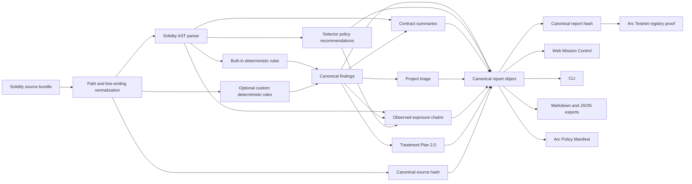

# VeilForge v1.8 architecture

VeilForge uses one canonical analyzer package. Every interface consumes the same report shape and hashing functions.

## Workspaces

### `packages/scanner`

The canonical engine. It owns parsing, built-in rules, custom-rule execution, score calculation, contract triage, exposure chains, treatment plans, comparison, report formatting and hashing.

### `apps/web`

The browser interface. It imports `@veilforge/scanner`; it does not implement a second scanner. Source is analyzed in the browser process.

### `packages/shared`

Arc Testnet constants and the registry ABI shared by the web app and integrations.

### `contracts`

The `VeilForgeReportRegistry` Hardhat workspace.

### `schemas`

Machine-readable contracts for canonical report and Arc Policy Manifest exports.

## Canonicality

The source hash normalizes path separators and line endings, sorts source files by path and hashes the resulting bundle with Keccak-256.

The report hash canonicalizes object keys and stable array ordering before Keccak-256. The `reportHash` field itself is excluded from the hashed payload.

The scanner version is part of the report hash. A rule change should increment the scanner version.

## Why the legacy standalone scanner was retired

Before v1.8, `standalone/app.js` contained a separate browser ruleset and used SHA-256. That made cross-interface report equality impossible. v1.8 replaces it with a notice and uses the TypeScript package everywhere.
