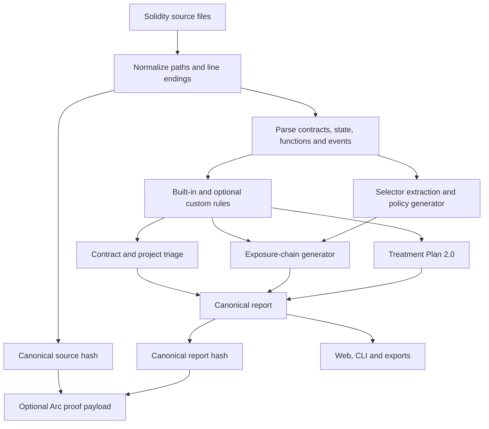

# VeilForge v1.8 Architecture

## Design goals

1. local source processing
2. deterministic output
3. one canonical analyzer for every surface
4. small, inspectable dependency boundary
5. reusable components for Arc builders
6. explicit proof payloads and wallet approval

## Components

### Canonical analyzer

`packages/analyzer/src/` contains the source parser, rule playbook, policy generator, exposure-chain generator, report builder, comparison logic, canonical serialization, and Keccak-256 implementation.

The browser and CLI import these modules directly. No alternate rule subset exists.

### Browser Mission Control

`apps/web/` is a static ES-module application. It supports file and folder intake, demo projects, triage, exposure chains, remediation, comparison, local history, proof publication, and exports.

The build script copies the canonical modules into `dist/engine/` instead of bundling a separate implementation.

### CLI

`packages/analyzer/cli.mjs` reads one Solidity file or recursively collects `.sol` files from a directory. Output formats are text, JSON, Markdown, and Arc Policy Manifest JSON.

### Proof module

`packages/proof/src/registry.js` provides:

- current Arc Testnet chain configuration
- EIP-3085 wallet network parameters
- deterministic ABI encoding for `publishReport`
- EIP-6963 multi-provider discovery with EIP-1193 fallback, chain switching, and transaction submission

The module never requests a private key.

## Data flow



## Determinism

The canonical source hash sorts normalized paths and joins each file as:

```text
path + NUL + normalized content + RECORD_SEPARATOR
```

The report hash uses recursively key-sorted JSON serialization. No generation timestamp, random value, browser state, project label, or network response is part of the canonical report.

Finding fingerprints use rule ID, normalized path, contract name, and compact evidence. This allows comparison to survive many line-number changes.

## Parser boundary

v1.8 uses an inspectable lexical Solidity parser rather than a dependency-heavy AST package. It recognizes:

- contracts, interfaces, and libraries
- top-level state declarations
- events
- constructors, functions, fallback, and receive
- visibility, mutability, modifiers, parameters, returns, and canonical signatures
- balanced braces, parentheses, brackets, comments, and quoted strings

Unsupported or malformed source creates `VF000` and blocks deployment. The parser is not a compiler and should not replace `solc`.

## Build pipeline

`npm run build:web`:

1. removes the prior `dist/`
2. copies the browser files
3. copies the canonical analyzer modules
4. copies the proof module and rewrites only its build-relative Keccak import
5. copies demo Solidity fixtures
6. injects a validated registry address into `dist/config.js`
7. writes a build manifest
8. verifies required output files

## Runtime security

- no source upload endpoint exists
- no analytics SDK is included
- no remote JavaScript or CSS is loaded
- local history can be cleared
- export downloads are generated in memory
- proof publishing requires a wallet confirmation
- report URI is optional and user-controlled
